# 🎯 Examuiz
### AI-Powered Exam Generation & Auto-Grading System
<div align="center">


*Revolutionizing education through intelligent exam creation and automated assessment*

**🚀 Participant  - Tarek Eloza Hackathon 2024**

</div>

---

## 📋 Project Overview

Examuiz is an innovative examination platform that leverages the power of Google's Gemini AI to automatically generate comprehensive exams and provide intelligent grading. Built with Flutter, this application streamlines the entire examination process for educators and students alike, making assessment creation effortless and evaluation precise.

## ✨ Key Features

### 🤖 **AI-Powered Exam Generation**
- **Smart Question Creation** - Gemini AI generates contextually relevant questions
- **Customizable Difficulty** - Adjustable complexity levels for different educational needs
- **Multiple Question Types** - MCQs, short answers, and essay questions
- **Topic-Based Generation** - Create exams focused on specific subjects or chapters

### 📝 **Intelligent Auto-Grading**
- **Instant Assessment** - Real-time evaluation of student responses
- **AI-Powered Scoring** - Advanced natural language processing for accurate grading
- **Detailed Feedback** - Comprehensive explanations for incorrect answers
- **Performance Analytics** - Detailed insights into student performance patterns

### 📱 **User Experience**
- **Intuitive Interface** - Clean, modern design optimized for both educators and students
- **Cross-Platform** - Seamless experience across mobile and tablet devices

## 🛠️ Technical Stack

| Component | Technology |
|-----------|------------|
| **Frontend** | Flutter & Dart |
| **AI Engine** | Google Gemini AI |
| **API Integration** | RESTful APIs with .NET Backend |
| **Version Control** | Git & GitHub |


## 🎯 Development Highlights

- ✅ **AI Integration** - Successfully integrated Gemini AI for exam generation
- ✅ **Auto-Grading System** - Implemented intelligent assessment algorithms
- ✅ **Cross-Platform UI** - Responsive design for multiple screen sizes


## 🚀 Core Functionalities

### For Educators
- **Quick Exam Creation** - Generate comprehensive exams in minute
- **Customizable Parameters** - Set difficulty, topic focus, and question count
- **Batch Processing** - Create multiple exam variations simultaneously
- **Performance Insights** - Detailed analytics on student performance

### For Students
- **Interactive Exam Interface** - User-friendly examination environment
- **Instant Results** - Immediate feedback and scoring
- **Learning Insights** - Personalized recommendations for improvement
- **Progress Tracking** - Monitor learning journey over time


## 🔧 Installation & Setup

```bash
# Clone the repository
git clone https://github.com/yourusername/examuiz.git

# Navigate to project directory
cd examuiz

# Install dependencies
flutter pub get

# Configure Gemini AI API key
# Add your API key to the configuration file

# Run the application
flutter run
```

## 🔮 Future Enhancements

- **Multi-Language Support** - Support for Arabic and other languages
- **Advanced Analytics** - Deeper insights into learning patterns
- **Collaborative Features** - Group exams and peer assessments
- **Integration APIs** - Connect with popular LMS platforms
- **Voice-to-Text** - Audio response capabilities
- **Plagiarism Detection** - AI-powered originality checking

## 🏗️ Architecture

> 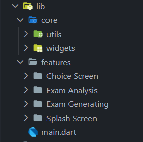


## 📱 UI
> 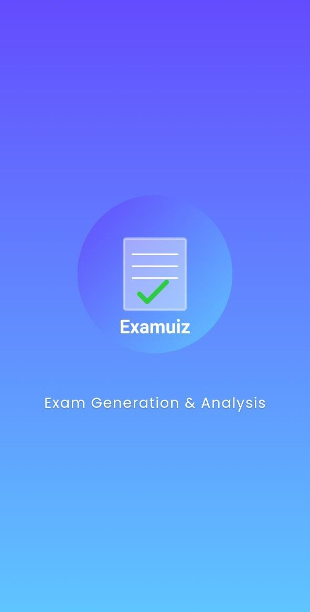
> 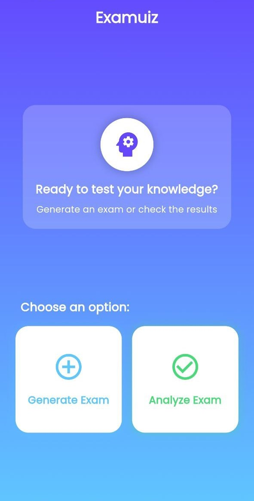
> 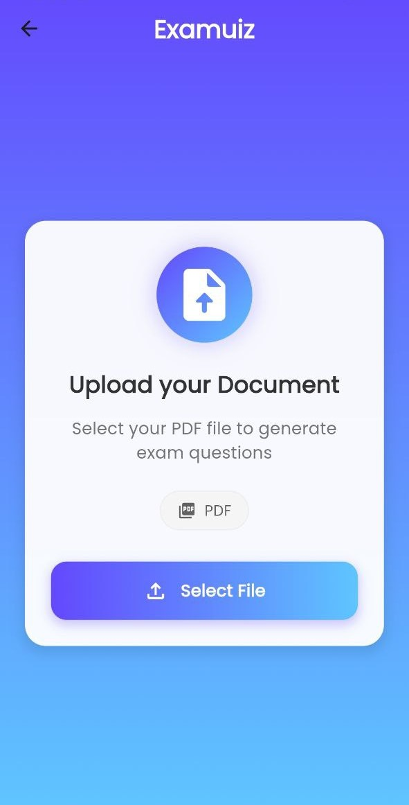
> 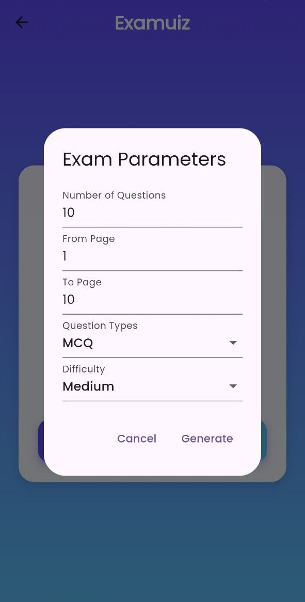
> 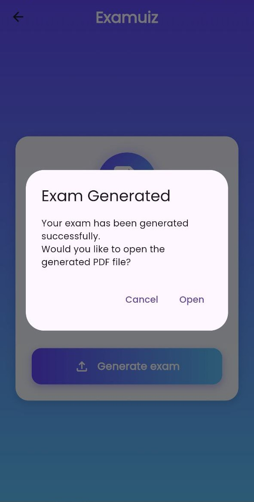
> 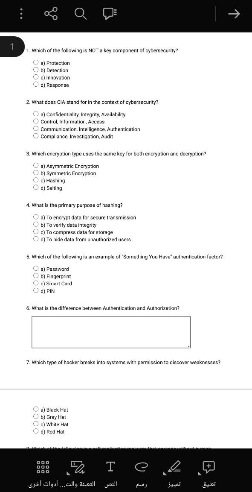
> 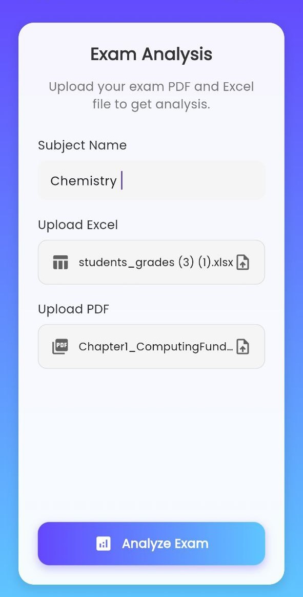
> 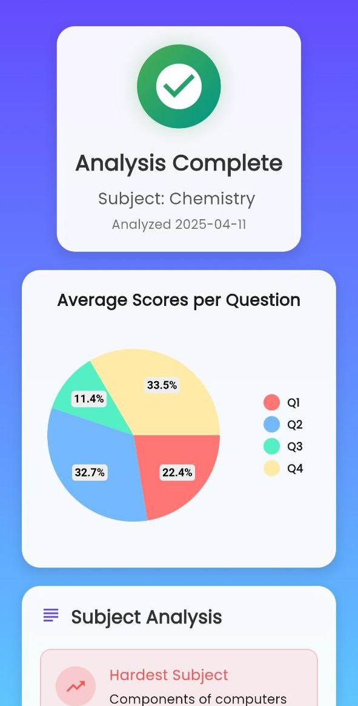
> 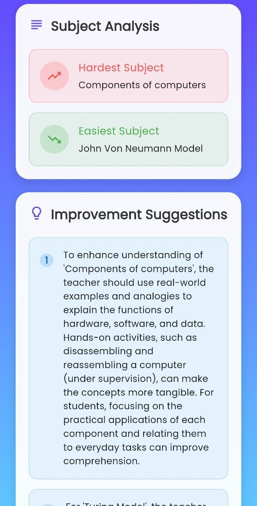
> 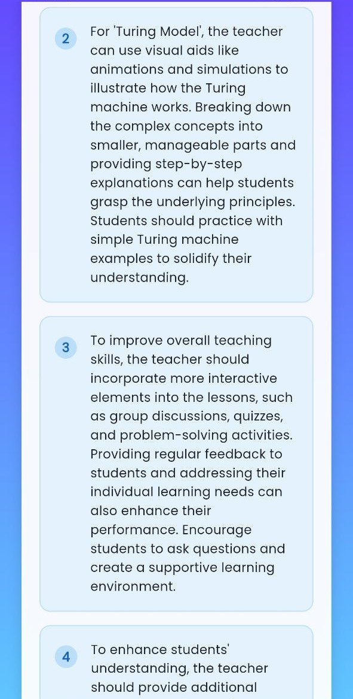
> 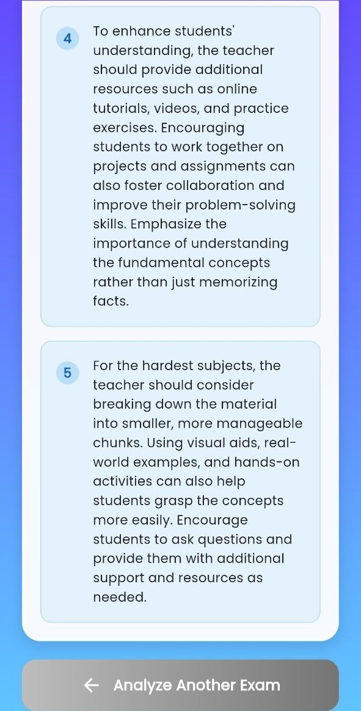


## 🎥 Demo Video

<div align="center">
  
  <!-- Direct Link as Backup -->
  <a href="https://drive.google.com/file/d/1IX084FnyZMcWjvm3wGOftlorQYdrYzK6/view?usp=drivesdk">
    <strong>📱 Open in Google Drive </strong>
  </a>
  
</div>

---

<div align="center">

**🎓 Transforming education through intelligent assessment 🚀**

⭐ **Star this repository if you believe in the future of AI-powered education!** ⭐

**Made with ❤️ using Flutter & Gemini AI**

</div>